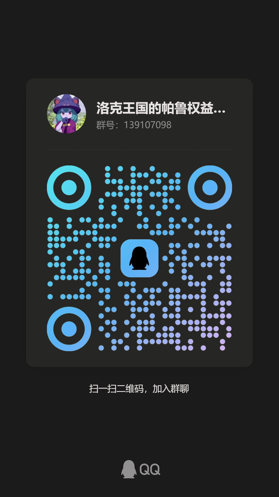

# 洛克王国世界 — 异色/噩梦/保底机制 原始数据

本仓库提供《洛克王国世界》异色精灵相关机制的原始数据，均从朋友处获得直接导出，未做任何计算或修改。

> **⚠️ 免责声明：所有字段名称和用途均为推测，不保证与服务端实际逻辑一致。本仓库仅提供原始数据，字段含义的解读仅供参考。**

> **数据版本**：2025 年 S1 赛季（2025-09-01 ~ 2026-05-21）

---

## 配套视频

**《异色机制完全解析》**：[https://www.bilibili.com/video/BV1NrD9BQEjg](https://www.bilibili.com/video/BV1NrD9BQEjg)

## 交流群

扫码加入 QQ 群，讨论游戏机制、分享游戏心得：

---

## 文件清单

### 1. `wish_number.csv` — 精灵噩梦进度条权重

来源表：`PETBASE_CONF`

每次捕获精灵时，噩梦进度条累加该精灵的 `wish_number` 值。该值越大，单次捕获对噩梦触发的贡献越高。

| 字段 | 说明（推测） |
|---|---|
| `petbase_id` | 精灵 ID |
| `name` | 精灵名称 |
| `stage` | 进化阶段（1=初始, 2=中间, 3=最终） |
| `pet_evolution_id` | 进化链 ID（同链精灵共享同一 ID） |
| `unit_type` | 属性 ID |
| `unit_type_name` | 属性名称 |
| `wish_number` | 噩梦进度条权重值 |

> 只含有 `wish_number` 的 747 只精灵，无此字段的精灵不参与噩梦机制。

---

### 2. `petbase_capture_fields.csv` — 精灵基础表（捕获相关字段）

来源表：`PETBASE_CONF`

全部 1015 只精灵的捕获相关原始字段。

| 字段 | 说明（推测） |
|---|---|
| `petbase_id` | 精灵 ID |
| `name` | 精灵名称 |
| `stage` | 进化阶段 |
| `pet_evolution_id` | 进化链 ID |
| `unit_type` | 属性 ID |
| `unit_type_name` | 属性名称 |
| `quality` | 品质等级 |
| `wish_number` | 噩梦进度条权重 |
| `Catch_Threshold_Bonus` | 捕获阈值加成（万分比） |
| `Catch_Threshold_Bonustime` | 捕获阈值加成次数 |
| `talent_amazing_chance` | 天赋卡槽 - 惊人概率（万分比） |
| `talent_good_chance` | 天赋卡槽 - 优秀概率 |
| `talent_normal_chance` | 天赋卡槽 - 普通概率 |
| `talent_perfect_chance` | 天赋卡槽 - 完美概率 |

---

### 3. `ball_conf.csv` — 捕获球配置表

来源表：`BALL_CONF`

全部 21 种捕获球的原始参数。

| 字段 | 说明（推测） |
|---|---|
| `id` | 球 ID |
| `ball_name` | 球名称 |
| `ball_prob` | 基础捕获概率（万分比，20000=200%） |
| `bigworld_catch` | 是否可在大世界使用 |
| `static_catch_rate` | 静态捕获率（-1=不启用, 10000=必捉） |
| `ball_threshold_modify` | 捕获阈值修正 |
| `guarant_efficiency` | 保底效率 |
| `Noeffect_ball_prob` | 无效果时的捕获概率 |
| `ball_effect_type` | 球效果类型（2=国王球, 3=棱镜球） |
| `hidden_capture_correction` | 隐藏捕获修正值 |
| `refresh_prob` | 刷新概率 |

---

### 4. `accu_pool_conf.csv` — 38 个保底池配置

来源表：`BONUS_EVENT_ACCU_POOL_CONF`

异色保底机制的 38 个池子，分三层优先级：进化链池 (19) > 属性池 (18) > 混沌池 (1)。

| 字段 | 说明（推测） |
|---|---|
| `id` | 池 ID |
| `accumulate_type` | 池类型（S1_EVO_x / S1_SKILLDAM_x / S1_CHAOS） |
| `priority` | 优先级（1000=进化链, 100=属性, 1=混沌） |
| `max_count` | 保底最多出异色次数（满后池子退休） |
| `trig_prob` | 触发概率参数 |
| `trig_times` | 触发次数参数 |
| `accu_60_prob` | 第 60 次软保底概率（万分比，1000=10%） |
| `accu_79_prob` | 第 79 次强软保底概率（5000=50%） |
| `accu_80_prob` | 第 80 次硬保底概率（10000=100%） |
| `accu_80_is_not_change` | 硬保底是否锁定计数器（True=必出） |

---

### 5. `nightmare_trigger_conf.csv` — 噩梦触发配置

来源表：`NPC_REFRESH_BONUS_CONF`

噩梦触发的核心参数，只有 1 条记录。

| 字段 | 说明（推测） |
|---|---|
| `id` | 配置 ID |
| `editor_name` | 配置名称 |
| `event_type` | 事件类型 |
| `event_count_type` | 计数类型 |
| `bonus_type` | 奖励类型 |
| `bonus_id` | 奖励 ID |
| `is_repeat_bonus` | 是否可重复触发 |
| `probability` | 硬保底配置（event_count_value=100 时必触发） |
| `prob_type` | 概率类型（2=公式型） |
| `prob_param1` | 公式参数 a（[520]） |
| `prob_param2` | 公式参数 b（[46]） |
| `trig_time_reset_type` | 重置类型（7=周期重置） |
| `trig_time_reset_begin` | 重置起始时间 |
| `trig_time_reset_gap` | 重置间隔（7 00:00:00 = 每 7 天） |
| `bonus_event_petbase_field_count` | 热机次数（前 30 次捕获不判定噩梦） |
| `is_refresh_petbase_field_count` | 切换进化链时是否重置计数器 |

---

### 6. `monster_catch_conf.csv` — 精灵捕获率配置表

来源表：`MONSTER_CATCH_CONF`

每只精灵独立的捕获难度参数，共 2009 条记录。这是决定"一只精灵好不好抓"的核心数据。

| 字段 | 说明（推测） |
|---|---|
| `id` | 捕获配置 ID（不同于 petbase_id） |
| `name` | 精灵名称 |
| `Catch_Threshold` | 捕获阈值（越低越难抓） |
| `catch_guarant_rate` | 保底捕获率（万分比，180=1.8%） |
| `Catch_Ball_level` | 最低球等级要求 |

**`Catch_Threshold` 档位分布：**

| Catch_Threshold | 精灵数量 | 难度 |
|---|---|---|
| 50000 | 20 | 噩梦精灵形态（极高阈值，特殊机制捕获） |
| 10000 | 2 | 特殊精灵 |
| 1000 | 471 | 普通精灵（最常见） |
| 500 | 276 | 较难捕获 |
| 250 | 553 | 稀有精灵（如恶魔狼） |
| 0 | 687 | 无阈值/不可捕获 |

**怎么用这张表：**

想知道一只精灵好不好抓，主要看两个字段：
- `Catch_Threshold`：捕获阈值，越高越容易抓。喵喵是 1000，恶魔狼只有 250
- `catch_guarant_rate`：保底捕获率，多扔几个球后的兜底概率。喵喵是 1700（17%），恶魔狼只有 180（1.8%）

最终捕获概率由多个因素共同决定，不是简单的乘法关系：
- 球的参数（`ball_conf.csv` 的 `ball_prob`、`ball_threshold_modify`）
- 精灵当前血量（血越低越好抓，红区 ≤30% 时概率最高）
- 控制状态（睡眠/冰冻/麻痹等有额外加成）
- 是否背击（从背后偷袭有概率加成）
- 连续失败累加（多次失败后有伪随机保底递增）
- 等级差（超过一定等级差后变难或无法捕获）

具体公式在服务端，客户端配置表无法看到完整算法。以上字段含义均为推测。

---

### 7. `bonus_pool_conf.csv` — 噩梦球池（7230 个球）

来源表：`BONUS_EVENT_POOL_CONF`

噩梦触发后抽球的完整球池。每个球有筛选条件和权重，`is_rare=True` 的是金球（出异色）。

| 字段 | 说明（推测） |
|---|---|
| `id` | 球 ID |
| `accumulate_type` | 保底池归属（出金球后计数器加到哪个池） |
| `petbase_field` | 筛选字段（pet_evolution_id=进化链, unit_type=属性, 空=无条件） |
| `field_match_type` | 匹配类型 |
| `petbase_field_param` | 筛选参数（进化链 ID 或属性 ID） |
| `petbase_need_persent` | 占比门槛（万分比，8000=最近 10 只中需 80% 匹配） |
| `pool_id` | 所属球池 ID |
| `bonus_type` | 奖励类型 |
| `bonus_param` | 奖励参数（指向刷新内容配置） |
| `weight` | 权重 |
| `weight_season_badge` | 赛季徽章加权（当前全为 0） |
| `is_rare` | 是否金球（True=出异色, 空=白球） |
| `enabletime` | 生效时间 |
| `disabletime` | 失效时间 |

---

## 补充说明

- 所有数据均从游戏客户端 JSON 配置表直接导出，未做任何二次计算
- **所有字段含义均为推测，不代表服务端实际逻辑，仅供研究参考**
- 唯一的处理：属性 ID 映射为中文名（来自 `TYPE_DICTIONARY`），球名填充（来自游戏内 UI）
- 概率字段均为万分比，如 `10000` = 100%, `1000` = 10%, `20000` = 200%
- 多值字段用 `|` 分隔
- CSV 编码为 UTF-8 with BOM，可直接用 Excel 打开

## License

数据来自我的朋友，版权归原开发者所有。本仓库仅供学习研究用途。
